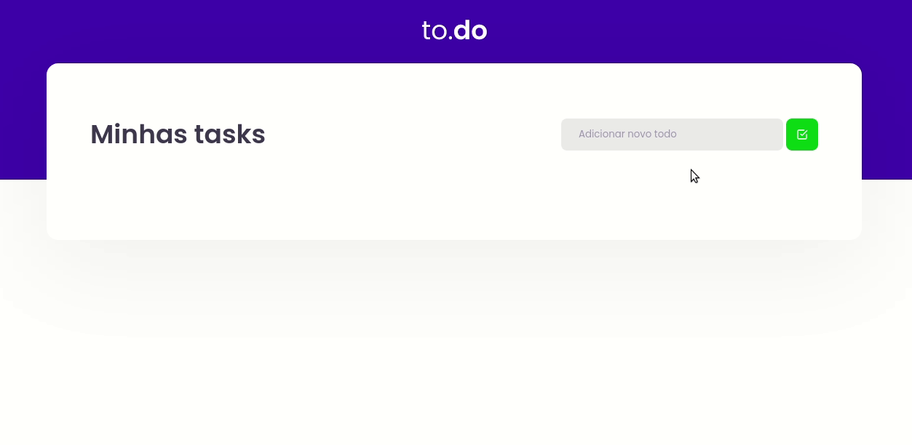

<p align="center">
  <h3 align="center">Ignite - Conceitos ReactJS</h3>

  <p align="center">
    Desafio da trilha do ReactJS sobre os conceitos.
    <br />
    <a href="https://github.com/lucfersan/ignite-reactjs-conceitos"><strong>Documentação »</strong></a>
    <br />
    <br />
    ·
    <a href="https://github.com/lucfersan/ignite-reactjs-conceitos/issues">Reportar Bug</a>
    ·
    <a href="https://github.com/lucfersan/ignite-reactjs-conceitos/issues">Requisição de Feature</a>
  </p>
</p>

## 📚 Sobre o Projeto


Essa é uma lista de afazeres para praticar os conceitos do ReactJS utilizando Typescript.

### 🛠️ Feito com

- [React](https://reactjs.org/)
- [Typescript](https://www.typescriptlang.org/)

### 💻 Instalação

1. Clone o repo
   ```sh
   git clone https://github.com/lucfersan/ignite-reactjs-conceitos.git
   ```
2. Instale os pacotes
   ```sh
   cd ignite-reactjs-conceitos
   yarn
   ```

### 🚀 Rodando local

1. Script para desenvolvimento
   ```sh
   yarn dev
   ```

## 🤝 Contribuições

As contribuições são o que torna a comunidade de código aberto um lugar incrível para aprender, inspirar e criar. Quaisquer contribuições que você fizer serão **muito apreciadas**.

1. Fork o Projeto
2. Crie uma Feature Branch (`git checkout -b feature/AmazingFeature`)
3. Commit suas mudanças (`git commit -m 'Add some AmazingFeature'`)
4. Push sua Branch (`git push origin feature/AmazingFeature`)
5. Abra um Pull Request

## 🗞️ Licença

Distribuído sob a licença MIT. Veja `LICENSE` para mais informações.

## 📬 Contato

Lucas Fernandes - fernandes.lucas11@outlook.com

### 😄 Agradecimentos especiais

- [Diego Fernandes](https://github.com/diego3g)
- [Rocketseat](https://github.com/Rocketseat)